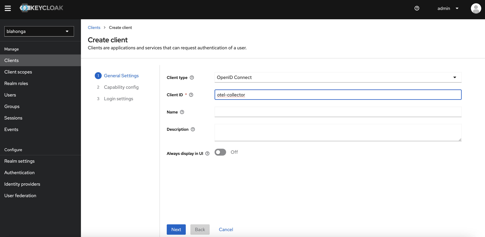
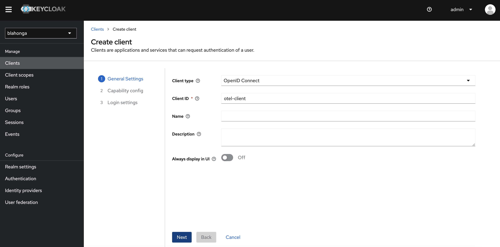
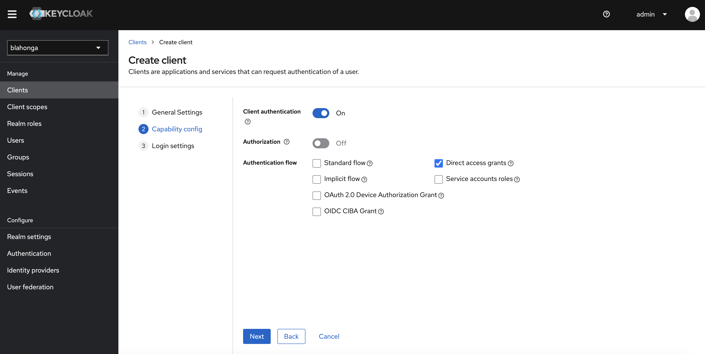
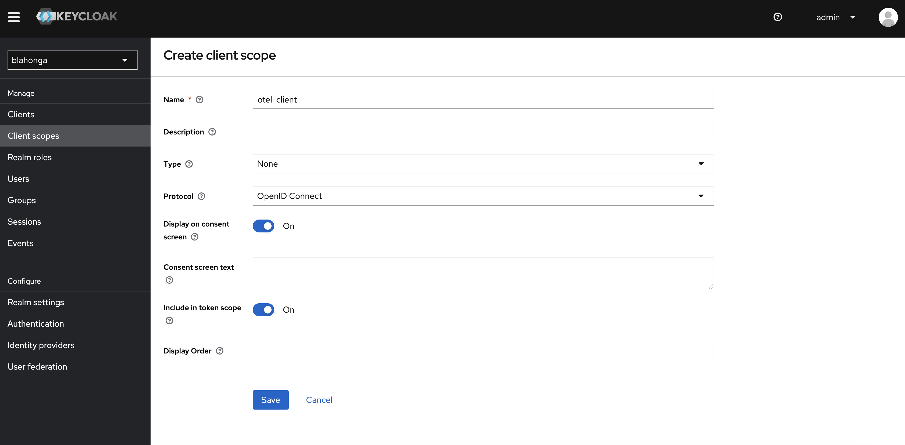
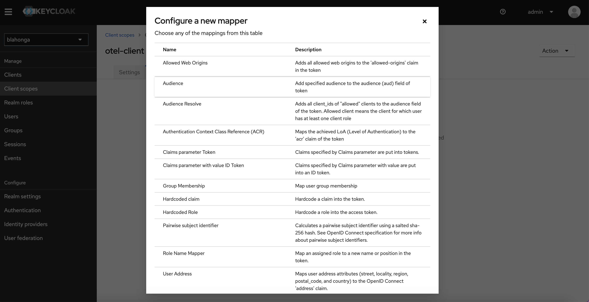
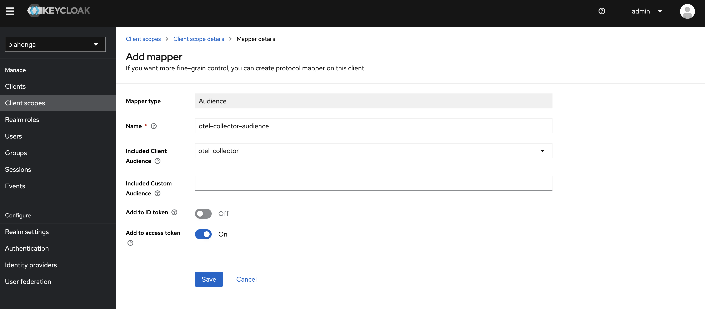
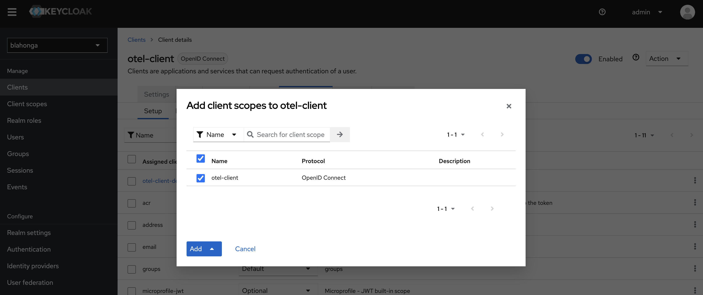

# Using Keycloak to secure OTEL Collectors in OpenShift

## Cluster preparations

See cluster-prep.md

## Tempo

We will be using Tempo for trace storage

1. Install the tempo operator

2. Create a bucket for tempo:

    ```shell
    oc project openshift-tempo-operator
    oc create secret generic tempo-prod-minio \
    --from-literal=bucket="hosted-tempo-prod" \
    --from-literal=endpoint="https://storage.blahonga.me:9199" \
    --from-literal=access_key_id="XXXX" \
    --from-literal=access_key_secret="XXXX"
    ```

3. Deploy an instance of Tempo:

    `oc apply -f manifests/1-tempo.yaml`

## Keycloak

1. Setup Keycloak:
   Create the OTEL Collector Client:
    

    This will be the agent token's audience

    Create the otel-client client:
    

    Change Client authentication to "on" and set the authentication flow:
    

    Create a new Client Scope:
    

    Create a mapper:
    

    Configure the mapper:
    

    Add the client scope to the agent:
    

## OTEL Operator

1. Install Red Hat build of OpenTelemetry

### OTEL Collector - Receiver (deployment mode)

Deploy the OTEL Collector that will be receiving traces/logs/metrics over OTLP from other collectors (agents).

1. Deploy the central Open Telemetry Collector:
  Create a project for the receiver collector:
  `oc new-project tracing-collector`

    * Add certificates:

      ```shell
      oc apply -f manifests/2-certificate.yaml
      ```

    * Install the collector for receiving OTLP:

      ```shell
      oc apply -f manifests/3-collector-receiver.yaml
      ```

      Note:

      ```yaml
      apiVersion: opentelemetry.io/v1alpha1
      kind: OpenTelemetryCollector
      ...
      spec:
        mode: deployment
        image: quay.io/cldmnky/otel/otel-collector:v0.88.0
        volumeMounts:
        - name: tls
          mountPath: /etc/pki/otel
          readOnly: true
        volumes:
        - name: tls
          secret:
            secretName: tracing-collector
        config: |
          extensions:
            ...
            oidc/server:
              issuer_url: https://storage.blahonga.me:10443/realms/blahonga
              audience: otel-collector
              attribute: authorization
          receivers:
            otlp:
              protocols:
                grpc:
                  auth: 
                    authenticator: oidc/server
                  tls:
                    cert_file: /etc/pki/otel/tls.crt
                    key_file: /etc/pki/otel/tls.key
                http:
                  auth: 
                    authenticator: oidc/server
                  tls:
                    cert_file: /etc/pki/otel/tls.crt
                    key_file: /etc/pki/otel/tls.key
      ```

    * Expose the central collector as a service:
      Need a DNS name matching the certificate...
      Add a service type loadBalancer:
      `oc apply -f manifests/4-collector-receiver-svc.yaml`

### OTEL Collector Agent (sidecar mode)

1. Setup the agent collector and deploy the OpenTelemetry demo

    ```shell
    oc new-project opentelemetry-demo
    oc apply -f 5-collector-sidecar.yaml
    ```

    Note:

    ```yaml
    extensions:
      oauth2client/client:
        client_id: otel-client # client name
        client_secret: DFKPGWSXC1TWSaBylE2JLwso2PAuumvi # TODO: client secret from keycloak, should use client_secret_file with a secrets mount
        token_url: https://storage.blahonga.me:10443/realms/blahonga/protocol/openid-connect/token
    ```

2. Deploy the opentelemetry demo
    `helm repo add open-telemetry https://open-telemetry.github.io/opentelemetry-helm-charts`
    `oc create sa opentelemetry-demo`
    `oc adm policy add-scc-to-user anyuid -z opentelemetry-demo`

    ```shell
    helm install my-otel-demo open-telemetry/opentelemetry-demo \
      --namespace opentelemetry-demo \
      --set serviceAccount.create=false \
      --set serviceAccount.name=opentelemetry-demo \
      --set prometheus.rbac.create=false \
      --set prometheus.serviceAccounts.server.create=false \
      --set prometheus.serviceAccounts.server.name=opentelemetry-demo \
      --set grafana.rbac.create=false \
      --set grafana.serviceAccount.create=false \
      --set grafana.serviceAccount.name=opentelemetry-demo \
      --values manifests/opentelemetry-demo.yaml
      ```